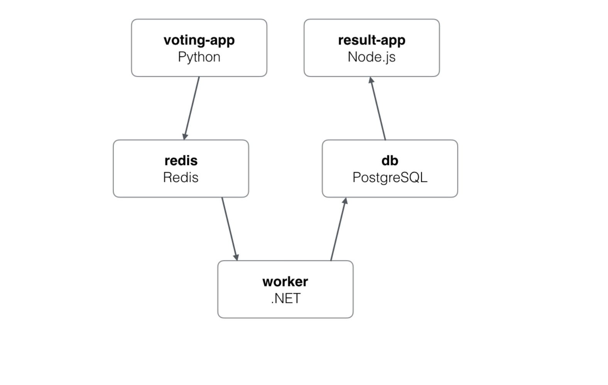

# Kubernetes vote-app deployment

## :scroll: Project description



### :pushpin: The Voting App consists of the following components: 

- A Frontend Service that serves the web application to users to vote for their favorite pets (cats or dogs). It is Developed using Python Flask.
- A Redis Service that stores the votes.
- A Worker Service that processes the votes and stores them in the Postgres database.
- A Postgres Service that stores the details of the votes such as the pet name and the number of votes.
- A Result Service that displays the results of the votes. It is Written in Node.js.

### :pushpin: Prerequisites

- A Linux Machine with Docker and Kubernetes installed.


### :pushpin: Project structure

- We create a yaml file for each service and deployment:

```
.
├── db-service.yaml
├── db.yaml
├── redis-service.yaml
├── redis.yaml
├── result-service.yaml
├── result.yaml
├── voting-app.yaml
├── voting-service.yaml
└── worker.yaml
```

- we run minikube start

### :pushpin: Usefull commands:

```
kubectl create -f file-name.yaml # create the deployment or service
```
```
kubectl apply -f file-name.yaml # command uset to apply changes made to a yaml file
```

```
kubectl get pods
```
```
kubectl get services
```
```
kubectl get deployments
```
```
kubectl get replicaset
```
```
kubectl describe pod pod-name
```

```
kubectl delete deployment name-of deployment # use the commmand carrefully
```
```
kubectl delete service service-name
```


